# Artikle - Some Text Deserves to Be Seen

## ✨ Why Artikle?
It all started with my little brother. He asked me something from his textbook, and like any busy older sibling, I gave him the universal “wait a minute.” That “minute” never came. But the idea stuck — what if text could just... come to life?

And just like that, inspired by the magical newspapers from Harry Potter (yes, the ones that move), Artikle was born. It's not wizardry — it's code. But to non-techies, the results are just as magical.


## 🧑‍💻 What Does Artikle Do?
Artikle is your mini creative studio in a Python pipeline. Give it an image of text—be it a textbook page, a news clipping, or even that 3rd grade storybook—and it’ll:
- 📸 Read the text using OCR (Tesseract).
- 🧠 Summarize the key idea using your favorite LLM (Gemini, OpenAI, or Ollama).
- ✏️ Craft an image generation prompt.
- 🎨 Generate a stunning image using DALL·E or a local diffusion model.

Yes, all of that. From one picture. You’re welcome.


## 🔥 Features
- 🖋️ **Image-to-Text Extraction**  
    Snatch text straight out of images (like textbooks, articles, or even that weird meme) using Tesseract OCR.

- 📚 **Smart Summarization**  
    Summon the power of LLMs—ChatGPT, Gemini, or Ollama—to compress walls of text into crystal-clear summaries.

- 🎯 **Built-in Prompt Engineering**  
    Automatically converts summaries into art-ready prompts, so you don’t have to channel your inner poet.

- 🖼️ **Stunning Image Generation**  
    Turn text into eye-candy using OpenAI’s DALL·E or locally hosted diffusion models like Stable Diffusion XL or Waifu Diffusion.

- 🔄 **Model-Switching Magic**  
    No need to crack open the code! Just tweak a `.env` file to swap between LLMs or image generators.

- 💡 **Prompt Customization? EZ.**  
    Want to fine-tune the image prompt style? Just edit a file in the `prompts directory` —no digging through code required.

- 🌍 **On-Prem Ready**  
    Run everything locally. No cloud? No problem. Perfect for secure, offline, or private deployments.

- 🔌 **API-First Architecture**  
    Use Artikle as a service! Easily integrate it into other apps, bots, or tools without rewriting logic.

- 🧪 **Minimal Dependencies, Max Impact**  
    Clean codebase with modular components—hackable, forkable, remixable.

- ✨ **Harry-Potter-Vibes? Definitely.**  
    Because why shouldn’t textbook learning feel like flipping through a magical newspaper?


## ⚙️ Setup Guide (Get Comfy First)
### 1️⃣ Clone the Repo and Install Dependencies
```bash
git clone https://github.com/AsutoshPati/artikle.git
cd artikle
```

[**Optional, but highly recomended**] Create a virtual environment to keep things clean, isolated, and drama-free (avoid any library conflicts):
```bash
python3 -m venv venv
source venv/bin/activate  
# On Windows use `venv\Scripts\activate`
```

Now install the required packages
```bash
pip install -r requirements.txt
```

### 2️⃣ Install Tesseract OCR (So Artikle Can "Read")
- Linux
    ```bash
    sudo apt install tesseract-ocr
    ```

- macOS
    ```bash
    brew install tesseract
    ```

- Windows <br>
    Download the installer from [Tesseract UB Mannheim](https://github.com/UB-Mannheim/tesseract/wiki) <br>
    And add the installation path to your system’s environment variables.

🔗 [Tesseract Documentation](https://tesseract-ocr.github.io/tessdoc/Installation.html)


### 3️⃣ LLM Setup
#### Install Ollama (if using local LLM)
Ollama runs models locally on your machine, like LLaMA or Mistral.
- Install from: <https://ollama.com/download>
- Run locally with:
    ```bash
    ollama run <model-name>
    # example: ollama run llama3.2:3b
    ```
- 🔗 Docs: [Ollama Dev Guide](https://github.com/ollama/ollama)


#### OpenAI
- Sign up: <https://auth.openai.com/create-account>
- Go to API keys → generate one.
- Docs: [OpenAI API Guide](https://platform.openai.com/docs/overview)


#### Gemini (Google AI)
- Visit: <https://makersuite.google.com/app>
- Create a project, get your API key.
- Docs: [Gemini API Reference](https://ai.google.dev/gemini-api/docs)


### 4️⃣ Configure the .env File
Copy from the template and make it your own:
```bash
cp sample.env .env
```

Then, update like so:

```env
# Server Config
HOST="0.0.0.0"
PORT=9090

# LLM Model Config
USE_MODEL="OLLAMA"
#### Options
#### GEMINI - API key needed
#### OLLAMA - Local (Prior installation required)
#### OPENAI - API key needed

# Image Gen Model Config
IMG_GEN_SERVICE="DIFFUSION"
#### Options
#### OPENAI - API key needed
#### DIFFUSION - Local (Prior installation required)

## OpenAI Config
OPENAI_API_KEY=<your_openai_api_key>
OPENAI_LLM_MODEL="gpt-4o-mini"
OPENAI_IMG_MODEL="dall-e-3"

## Gemini Config
GEMINI_API_KEY=<your_gemini_api_key>
GEMINI_MODEL="gemini-2.0-flash"

## Ollama Config
OLLAMA_MODEL="llama3.2:3b"

## HuggingFace Credential
HF_TOKEN=<your_huggingface_token>

## Diffusion Model
DIFFUSION_MODEL_OPT=2
#### Options
#### 1 - Stable Diffusion by RunwayML
#### 2 - Stable Diffusion XL
#### 3 - Flux v1 Dev (Do not use; requires very high GPU)
#### 4 - Waifu Diffusion
#### 5 - DeepFloyd IF (Do not use; requires very high GPU)
```


## 🪄 Run the Magic (Project)
Once everything is set up; You’re ready to turn boring old text into magic!
```bash
python main.py
```
Now sit back and let Artikle turn words into worlds.


### 🔌 API Quick Peek
**Endpoint:** `/upload` <br>
**Method:** `POST` <br>
**Content-Type:** `multipart/form-data`

**Payload Example:**
```form
style: realistic  # options: cartoon, comic, realistic
file: your_image.png
```

**Sample Response:**
```json
{
  "summary": "Photosynthesis is the process...",
  "image_prompt": "A lush green forest under sunlight showing energy transfer",
  "generated_image": "http://localhost:9090/images/generated.png"
}
```

>💡 You can also use the prompt in your own image tools (ChatGPT web UI does wonders with it).


<br>
Or, you can also use a minimalistic UI to call this API; <br>
Just head to the built-in Swagger Doc interface:
<br><br>

Swagger Endpoint: `/docs`
- Click “Try it out”
- Choose your desired image style
- Upload the image with the text content you want visualized
- Hit "Execute" and relax while the magic happens


### 🔄 Switching Between Models
Change these in your .env, no code edits needed:
```env
USE_MODEL="GEMINI"  # or OPENAI or OLLAMA
IMG_GEN_SERVICE="DIFFUSION"  # or OPENAI
DIFFUSION_MODEL_OPT=1  # 1 to 5 options available
```

Diffusion Options:
| Option    | Model Name |
| --------- | ---------- |
| 1 | RunwayML Stable Diffusion v1.5 |
| 2 | Stable Diffusion XL            |
| 3 | Flux v1 Dev (GPU hungry!)      |
| 4 | Waifu Diffusion                |
| 5 | DeepFloyd IF (GPU hungry!)     |

😞 Not happy with the response? Want to upgrade the prompt? <br>
🤩 **It’s EZ!** <br>
> You don’t even need to touch the code — just head over to the **prompts directory** and tweak the templates to your heart’s content. Your creativity, your rules.


## 🖼 Sample Gallery

<div align="center">
  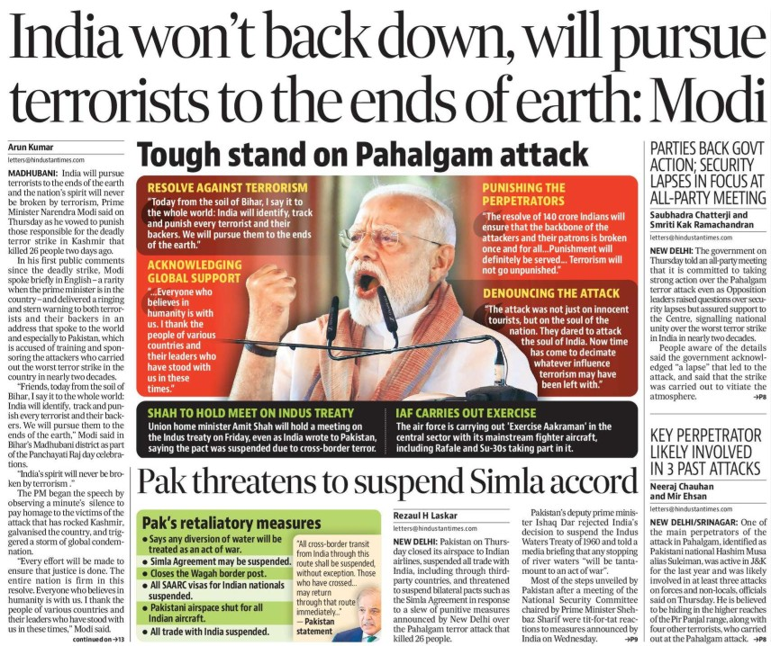
  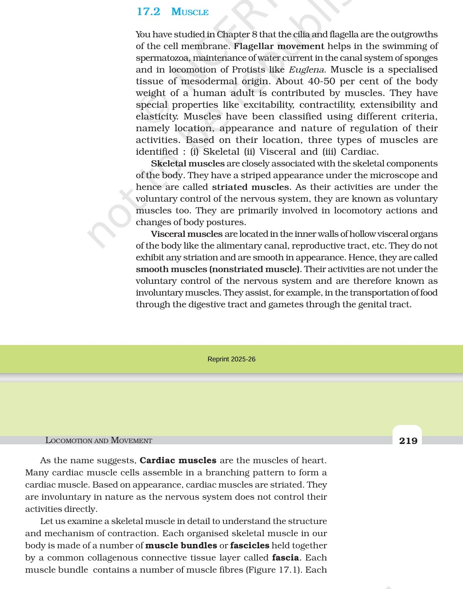
  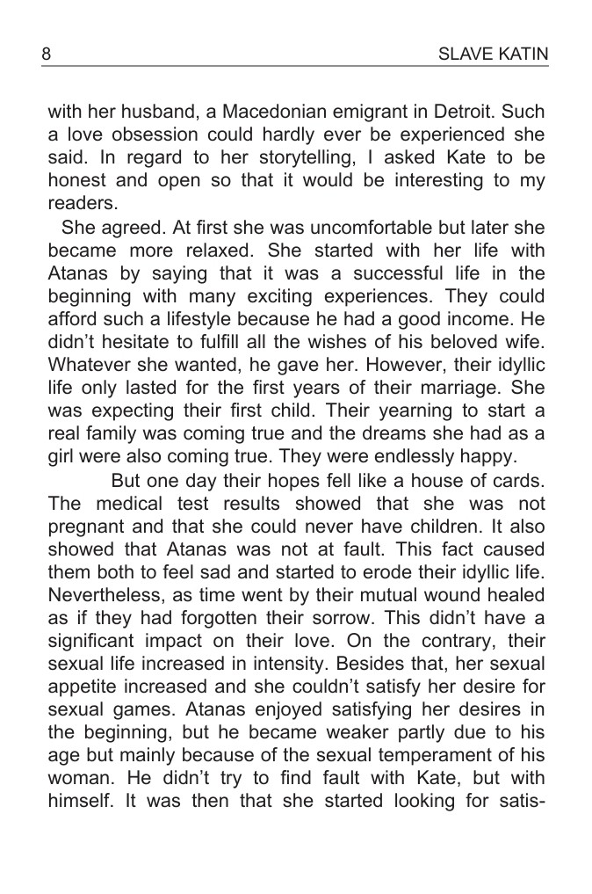
</div>

<div align="center">
  
  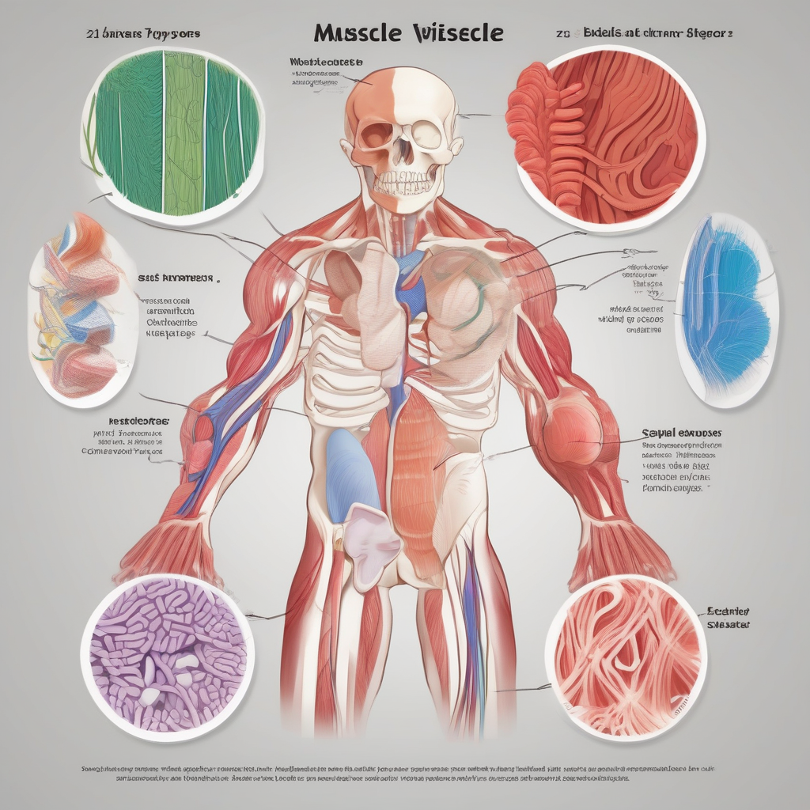
  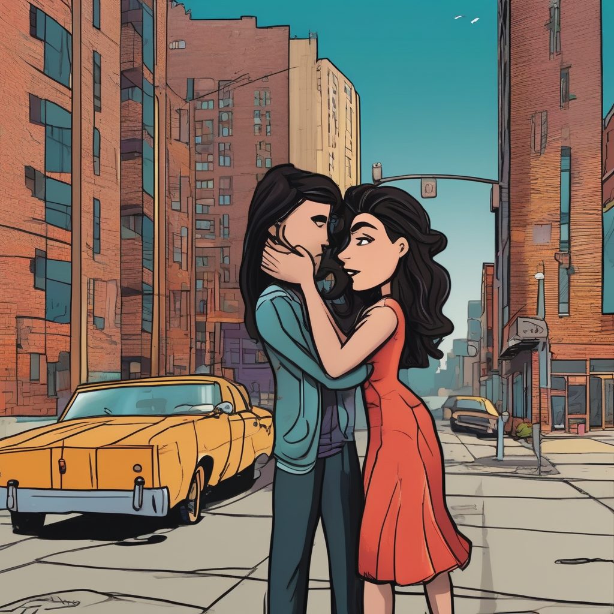
</div>

<div align="center">
  
  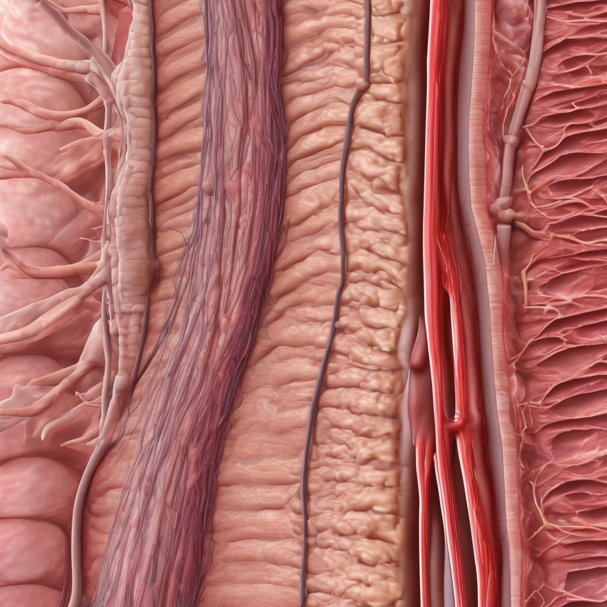
  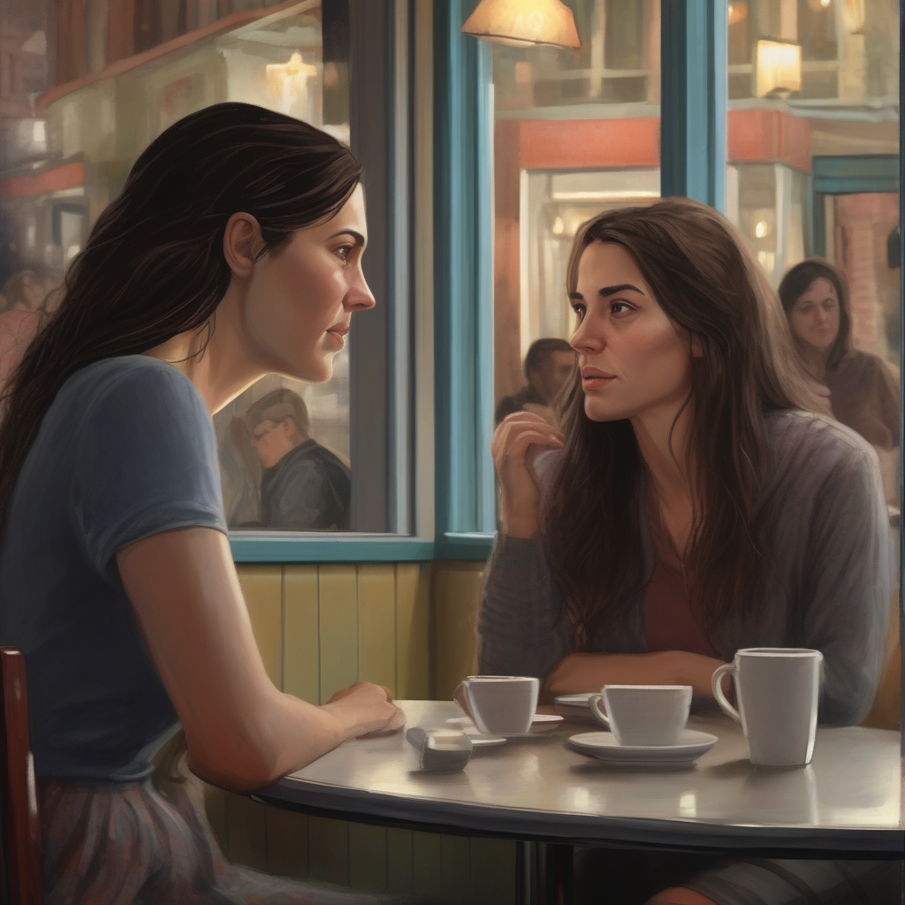
</div>

<div align="center">
  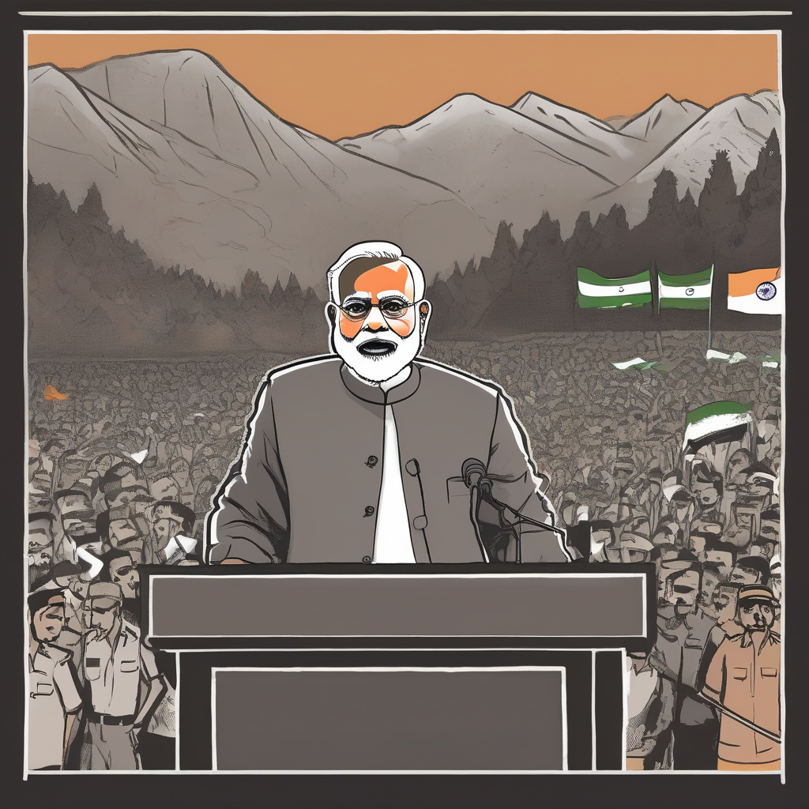
  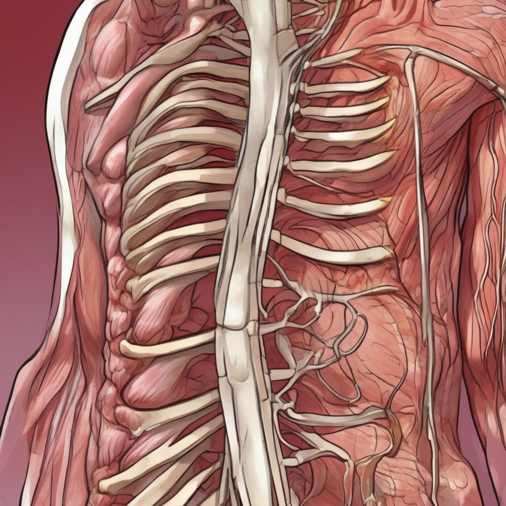
  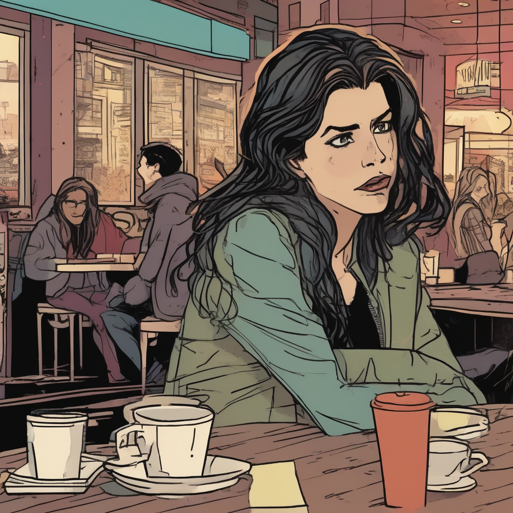
</div>

<br><br><br>

**By ChatGPT**
<div align="center">
  
  
  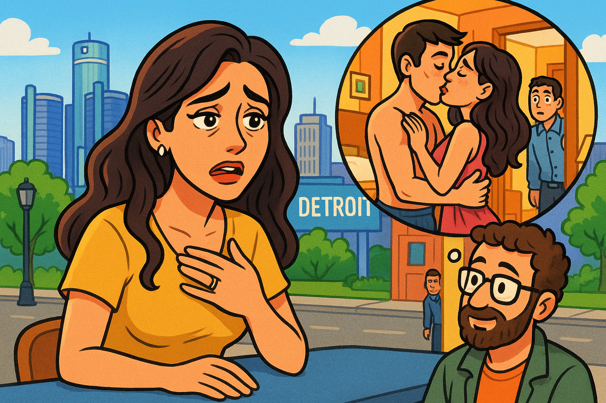
</div>

<div align="center">
  
  
  
</div>

<div align="center">
  
  
  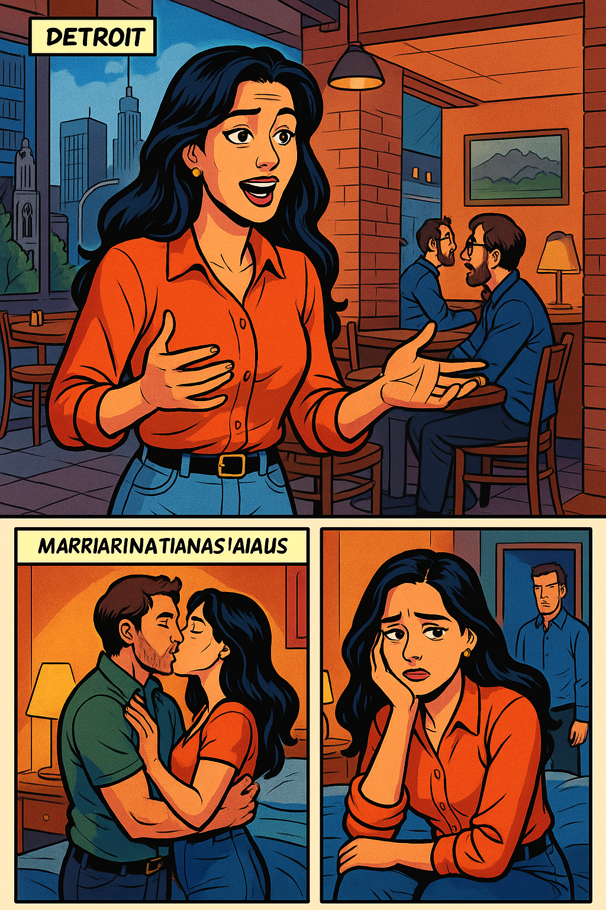
</div>


## 🧭 Roadmap / Future Improvements
- 🔊 Add Text-to-Speech narration
- 🎮 Let users fine-tune image styles
- 🧠 Support more LLM/image models
- 🌐 Host a web UI for non-tech users


## 🧑‍💻 For Devs Who Still Read READMEs 🤝
You made it to the bottom? You're my kind of developer. Thanks. ❤️ <br>
This project was written not just to solve a problem, but to spark a little joy and curiosity. <br>
Feel free to fork, hack, and build something even cooler with it. And, don’t forget to ⭐ **give a star** if you liked the project — it really helps and keeps the magic going!


## 📝 License
This project is licensed under the MIT License - see the [LICENSE]() file for details.


## 🙌 Shoutout
- Inspired by my curious little brother 🧒
- And Harry Potter, for making newspapers awesome again.
- Thanks to the incredible models by OpenAI, Hugging Face, Google AI, and Ollama.
